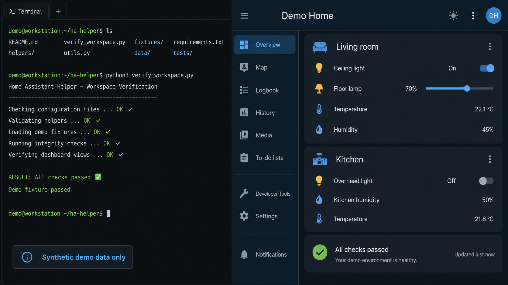

# Home Assistant AI Copilot Toolkit

## Problem

Home Assistant configuration often spans several inputs, which makes it hard to give an AI assistant useful context without exposing a live household setup.

## What this toolkit does

This small toolkit builds a lightweight context index from explicit inputs, creates REST-based incident bundles, verifies a workspace, and includes helpers for inspecting Node-RED exports.

## Public-safe scope

This is a release artifact, not a backup or a full agent product. It includes generic scripts, documentation, and redacted fixtures only. It excludes live Home Assistant exports, private `.env` files, generated outputs, backups, pulled dashboard data, and house-specific names. See [the privacy boundary](docs/privacy-boundary.md).

## How it works

1. Pass the relevant configuration roots explicitly.
2. Build an index or incident bundle into `output/`.
3. Run the verifier against either the included redacted fixture set or your own local paths.
4. Use the optional PowerShell wrappers when working with sibling repositories.

See [the workflow overview](docs/workflow-overview.md) for the detailed flow.

## Visual evidence

The image below is a synthetic demo. It contains fictional labels and no live system, credential, URL, or infrastructure information.



*Synthetic verification result shown with example dashboard data only.*

## Contents

- `build_ha_index.py`, build a lightweight context index from explicit inputs
- `ha_incident_bundle.py`, build a REST-based incident bundle
- `verify_workspace.py`, run smoke tests against the toolkit and optional inputs
- `verify-workspace.ps1`, PowerShell wrapper for the verifier
- `sync-ha-config.ps1`, PowerShell wrapper for sibling repo syncs
- `scripts/`, Node-RED inspection helpers
- `examples/sample_workspace/`, redacted fixtures

## Quick Start

Run the help for any script first:

```powershell
python .\build_ha_index.py --help
python .\ha_incident_bundle.py --help
python .\verify_workspace.py --help
python .\scripts\split_flows.py --help
python .\scripts\spot_check_flows.py --help
```

Build the example index:

```powershell
python .\build_ha_index.py `
  --root . `
  --ha-config-root .\examples\sample_workspace\home-assistant-config `
  --editable-root .\examples\sample_workspace\home-assistant-config-editable `
  --node-red-root .\examples\sample_workspace\home-assistant-node-red `
  --lovelace-root .\examples\sample_workspace\home-assistant-lovelace `
  --output .\output\ha-index
```

Run the smoke tests on the redacted fixture set:

```powershell
python .\verify_workspace.py `
  --root . `
  --ha-config-root .\examples\sample_workspace\home-assistant-config `
  --editable-root .\examples\sample_workspace\home-assistant-config-editable `
  --node-red-root .\examples\sample_workspace\home-assistant-node-red `
  --lovelace-root .\examples\sample_workspace\home-assistant-lovelace
```

## Environment

`ha_incident_bundle.py` reads:

- `HASS_HOST`
- `HASS_TOKEN`
- `HASS_WS_URL` or `HASS_SOCKET_URL`

Use `.env.example` as the template for a repo-local `.env`.

The workspace-owned sync deployment uses Home Assistant REST with `HASS_TOKEN`
and optional `HASS_HOST`. It resolves each setting from the process environment,
then the Windows User environment, then a gitignored toolkit `.env`. The
workspace tool defaults to deployment, in this order: publish editable config,
run the managed pull, run the managed backup, refresh the local backup, then
build local views. Use `-SkipHaDeployment` only for a repository-only run.

## Companion tools

This toolkit does not include the full Lovelace sync utility. The companion
`home-assistant-lovelace` repo owns that workflow.
